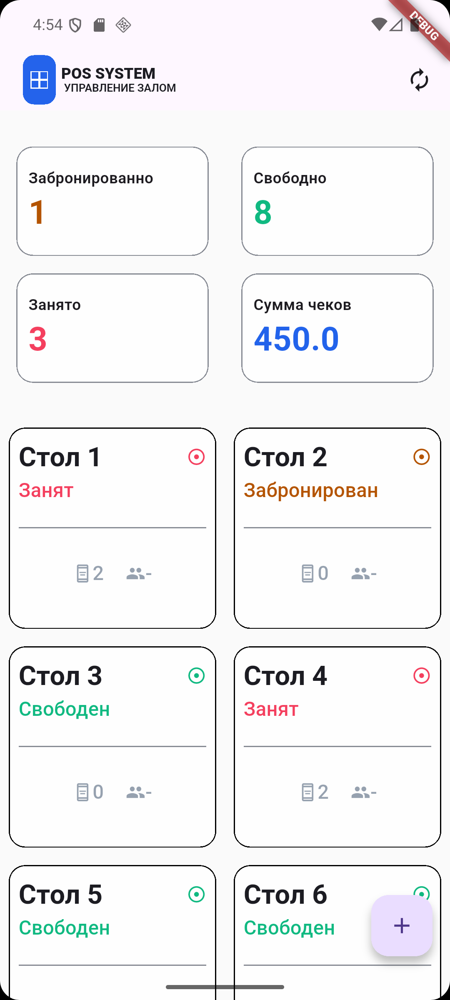
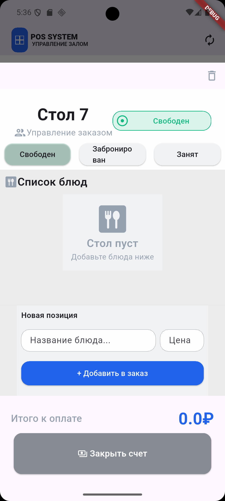
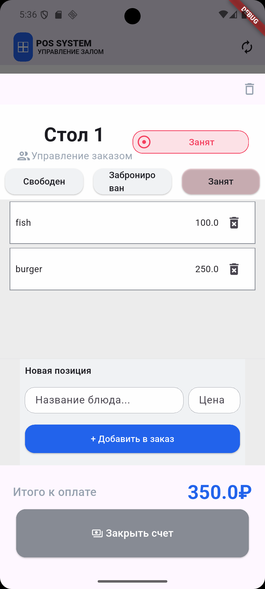
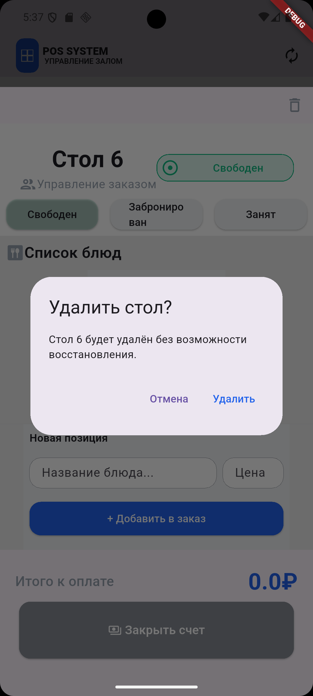

# waiter_app

# Waiter App

A Flutter application designed to simplify table and order management for restaurant waiters.

The application allows waiters to monitor table statuses, manage orders, calculate totals, and continue working without an internet connection using local data persistence.

## Features

*  View all restaurant tables and their current status
*  Mark tables as free
*  Mark tables as booked
*  Mark tables as occupied
*  Add dishes to a table's order
*  Remove dishes from an order
*  Automatically calculate order totals
*  Display statistics for table statuses
*  Persist table and order data locally with Hive
*  Fully functional offline
*  Reactive UI updates using BLoC

## Screenshots

| Home Screen | Table Menu |
|-------------------|-------------------|
|  |  |

| Add Dish | Delete Dish |
|-------------------|-------------------|
|  |  |

## Architecture

The project uses a feature-based structure with separation between presentation, domain and data layers.

```text
lib/
├── core/
│   ├── style/
│   ├── enum/
│   └── utils/
│
├── feature/
│   └── home_page/
│       ├── data/
│       │   ├── datasource/
│       │   │   └── local/
│       │   ├── model/
│       │   └── repo/
│       │
│       ├── domain/
│       │   ├── entity/
│       │   ├── repo/
│       │   └── usecase/
│       │
│       └── UI/
│           ├── bloc/
│           ├── page/
│           └── widgets/
│
└── main.dart
```

### Data layer

Responsible for data persistence and implementation details.

* Local datasource
* Hive models
* Repository implementation

### Domain layer

Contains the application's core business entities and abstractions.

* `TableEntity`
* `OrderEntity`
* Repository contract
* Use cases

### Presentation layer

Responsible for UI and application state.

* Flutter widgets
* BLoC
* Events
* States
* Reusable UI components

## State Management

The application uses **BLoC** for managing table and order state.

User interactions are represented as events, for example:

* adding an order;
* deleting an order;
* changing table status;
* confirming a table;
* adding a new table.

The BLoC updates the application state and persists the changes through the domain layer.

```text
User interaction
       ↓
      BLoC
       ↓
    Use Case
       ↓
  Repository
       ↓
Local Datasource
       ↓
     Hive
```

## Local Storage

The application uses **Hive** for local data persistence.

Table and order data is stored locally, allowing the application to continue working without an internet connection.

Changes made by the user are persisted after operations such as:

* adding an order;
* deleting an order;
* changing a table status;
* confirming a table.

## Tech Stack

* **Flutter**
* **Dart**
* **BLoC / flutter_bloc** — state management
* **Hive** — local NoSQL persistence
* **Cleanly separated data, domain and presentation layers**
* **Material UI**

## What This Project Demonstrates

This project was built to practice and demonstrate practical Flutter development skills:

* Building reusable Flutter UI components
* Managing application state with BLoC
* Separating business logic from presentation
* Working with repositories and use cases
* Implementing local data persistence with Hive
* Creating domain entities and data models
* Handling different UI states
* Building an offline-first application
* Organizing a feature-based Flutter project

## Getting Started

### Requirements

* Flutter SDK
* Dart SDK
* Android Studio or VS Code
* Android emulator or physical Android device

### Installation

Clone the repository:

```bash
git clone https://github.com/noderunnersom-debug/waiter-app.git
```

Navigate to the project:

```bash
cd waiter-app
```

Install dependencies:

```bash
flutter pub get
```

Run the application:

```bash
flutter run
```

## Project Status

The application represents an initial production-oriented version focused on core restaurant table and order management functionality.

Future improvements may include:

* Remote backend synchronization
* Authentication and user accounts
* Multiple restaurant support
* Order history
* Cloud data synchronization
* More advanced table and order management

## Author

noderunnersom
Developed as a Flutter portfolio project.
